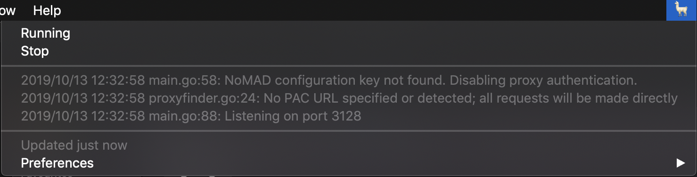

# Alpaca Desktop

[BitBar][1] distribution including [Alpaca][2] and [launchd][3] daemon and [BitBar][1] plugin.



## Install

`Alpaca.app` can be downloaded from [here][4].

## Build

```
bin/build
```

Creates a `dist/Alpaca.app`.

[1]: https://github.com/matryer/bitbar
[2]: https://github.com/samuong/alpaca
[3]: https://developer.apple.com/library/archive/documentation/MacOSX/Conceptual/BPSystemStartup/Chapters/CreatingLaunchdJobs.html
[4]: https://github.com/jamesmoriarty/alpaca-desktop/releases
