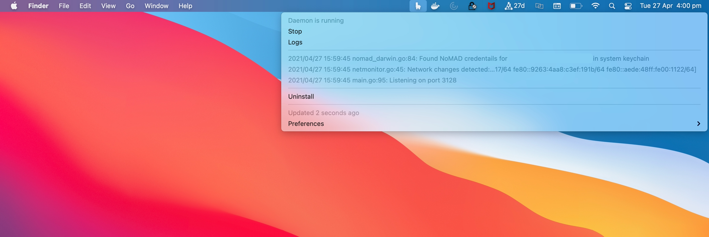

# Alpaca Desktop

OSX menu bar widget for [Alpaca][2]. Built with [BitBar][1] distribution and includes [Alpaca][2] and [launchd][3] daemon.



## Install

```
Alpaca.app
```
Releases can be downloaded from [here][4].

## Build

```
bin/build
```
Build artifact can be found at `dist/Alpaca.app`.

## Icon

```
cat src/icons/icon.png | base64
```

Tested with `64x64px image/png`.


[1]: https://github.com/matryer/bitbar
[2]: https://github.com/samuong/alpaca
[3]: https://developer.apple.com/library/archive/documentation/MacOSX/Conceptual/BPSystemStartup/Chapters/CreatingLaunchdJobs.html
[4]: https://github.com/jamesmoriarty/alpaca-desktop/releases
